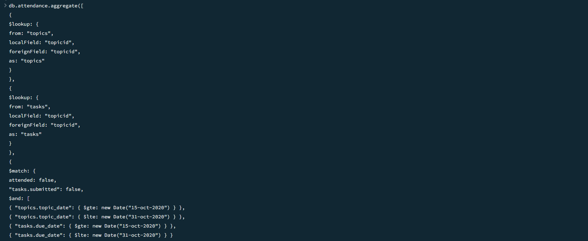

# **_MongoDB Task_**

## **_To view the Document file_**

+ Click on the `MongoDB-Task-2.docx` file above to `Download` and view the file in which I've attached the `Screenshot` below each `Query` respectively.

## **_MongoDB_**

+ MongoDB is built on a scale-out architecture that has become popular with developers of all kinds for developing scalable applications with evolving data schemas.

+ As a document database, MongoDB makes it easy for developers to store structured or unstructured data. It uses a JSON-like format to store documents. 
  
+ This format directly maps to native objects in most modern programming languages, making it a natural choice for developers, as they don’t need to think about normalizing data. 
  
+ MongoDB can also handle high volume and can scale both vertically or horizontally to accommodate large data loads.

+ MongoDB was built for people building internet and business applications who need to evolve quickly and scale elegantly. Companies and development teams of all sizes use MongoDB for a wide variety of reasons.

## **_Features_**

+ Document Model
+ Deployment Options
+ Get Started Quickly
+ Fully Scalable
+ Find Community

## **_Technology Used_**

+ MongoDB
  

## **_MongoDB 6 Questions & Queries_**

### 1. Find all the topics and tasks which are thought in the month of October

### 2. Find all the company drives which appeared between 15 oct-2020 and 31-oct-2020

### 3. Find all the company drives and students who are appeared for the placement.

### 4. Find the number of problems solved by the user in codekata

### 5. Find all the mentors with who has the mentee's count more than 15

### 6. Find the number of users who are absent and task is not submitted  between 15 oct-2020 and 31-oct-2020

   
   

